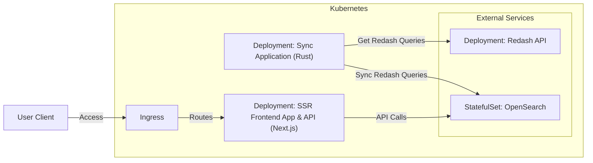

# Redash Searcher

Web application for searching Redash queries.
Queries are stored in OpenSearch and synchronized with Redash periodically.

## Start Up

:pencil2: Copy `.env.sample` to `.env.docker` and edit it.

```console
cp .env.sample .env.docker
```

:rocket: Start up containers.

```console
docker compose up
```

## Example Architecture to Deploy

We provide a [Helm Chart](https://github.com/gunosy/public-helm-charts/tree/main/charts/redash-searcher) for this application.
You can deploy this application to Kubernetes with the Helm Chart.

> **Note**:
> Redash and OpenSearch are required to deploy by yourself.

The following diagram shows the architecture of the example deployment.


